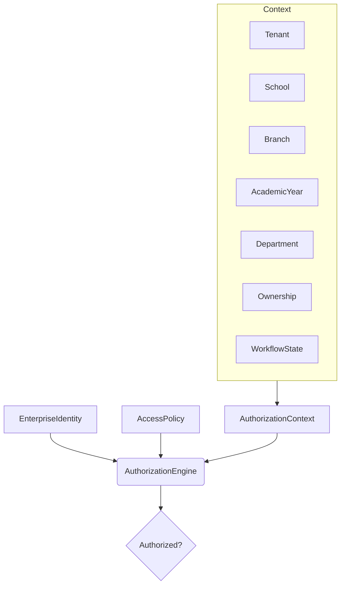

# Authorization Dependency Graph

```mermaid
graph TD
    A[EnterpriseIdentity] --> B(AuthorizationEngine)
    C[AccessPolicy] --> B
    D[AuthorizationContext] --> B
    B --> E{Authorized?}
    
    subgraph Context
        F[Tenant]
        G[School]
        H[Branch]
        I[AcademicYear]
        J[Department]
        K[Ownership]
        L[WorkflowState]
    end
    
    Context --> D
```
